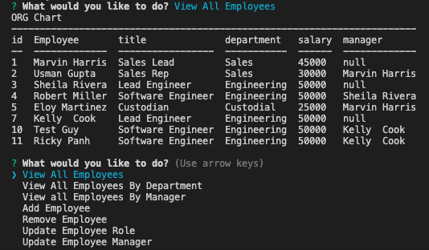

# Employee Management System



## Description

This is a basic Node CMS app for employee management. Functionality includes viewing data tables, inputting new employees as well as updating role and manager assignment.

A video demonstrating functionality is linked [here](https://drive.google.com/file/d/1GXWye3UQwalR8NkSazQCMeOG8AKfLcOL/view?usp=sharing)

## Table of Contents

\*[Installation](#installation)

\*[Usage](#usage)

\*[Contributing](#contributing)

\*[Tests](#tests)

\*[Questions](#tests)

## Installation

To install modules run

```

 npm i

```

You will need to run the schema file to create your database in MySQL to make this app function.

## Usage

This app will allow you to view a table of the entire organization, employees by department as well as employees by manager.

New employees are added by department, then the role and manager must be updated.

If an employee does not report to anyone their manager will display as null, and must be updated as such upon promotion.

## Questions

If you have any questions about the repo, open an issue or contact me directly at emartizzle2185@me.com.
You can find more of my work at E-Martinez77
